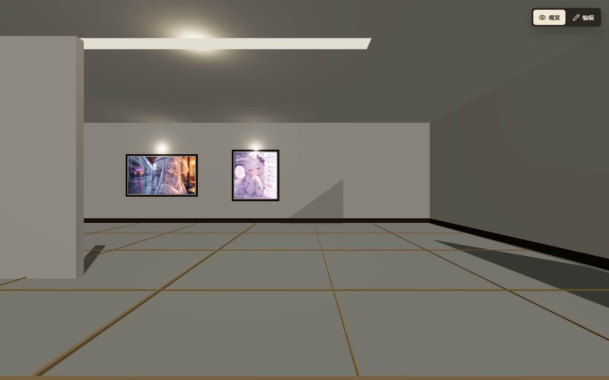
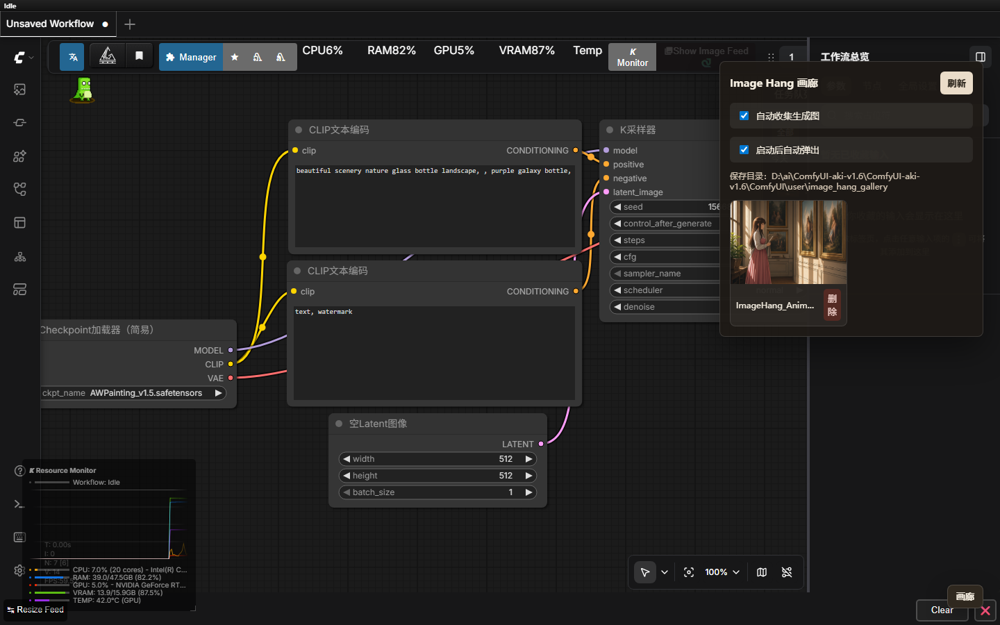

# Image Hang

Image Hang 是一个可以作为 ComfyUI 扩展使用的 3D 画廊工具。它既能在浏览器里独立运行，用来布置房间、挂画、保存展览布局，也能安装到 ComfyUI 里，通过弹出的画廊面板管理生成图片，并选择是否把生成结果自动保存到画廊。

## 项目组成

- `src/`：独立 3D 画廊应用，基于 React、TypeScript、Vite 和 Three.js。
- `comfyui-extension/ComfyUI-ImageHang-Gallery/`：ComfyUI 扩展源码，可复制到 ComfyUI 的 `custom_nodes` 目录使用。
- `.gallery-data/`：独立应用的本地保存目录，运行时自动生成，不提交到仓库。

## 截图演示

独立 3D 画廊可以把本地图片、上传图片或 ComfyUI 生成图挂到房间墙面上，并在观赏模式中直接走进展览空间。



ComfyUI 扩展会在工作流页面中提供“画廊”面板，可以开启自动收集生成图，查看保存目录，并直接管理已经进入画廊的图片。



## ComfyUI 扩展

把扩展目录复制到 ComfyUI：

```text
ComfyUI/custom_nodes/ComfyUI-ImageHang-Gallery
```

重启 ComfyUI 后，页面右下角会出现“画廊”按钮。面板支持：

- 查看和删除画廊图片。
- 启动后自动弹出。
- 开启“自动收集生成图”，在 ComfyUI 工作流执行完成后把输出图片复制到画廊。

ComfyUI 扩展的数据会保存到：

```text
ComfyUI/user/image_hang_gallery/gallery.json
ComfyUI/user/image_hang_gallery/images/
```

这样保存结果不依赖浏览器缓存，也不会因为换浏览器、换浏览器 Profile、或 `localhost` / `127.0.0.1` 地址不同而丢失。

## 独立 3D 画廊

双击 `start.bat`，或运行：

```powershell
npm install
npm run dev
```

打开 Vite 输出的地址即可使用。独立应用支持第一人称观赏、俯视编辑、房间扩展、自定义墙、挂画布局、删除快捷键、手动保存到本地和自动保存。

## 操作

- 观赏模式：点击 `进入画廊`，使用 `WASD` 移动，`Shift` 奔跑，`Space` 跳跃。
- 编辑模式：从列表选择画作，或直接点击场景中的画框，然后调整墙面、位置、高度和尺寸。
- 俯视编辑：可以选择房间、门、画作等对象进行摆放；按住 `F` 可固定视角并拖动已选对象。
- 上传图片后会进入待放置状态，点击墙面即可把图片挂到对应位置。
- 点击“保存到本地”会把当前画廊写入 `.gallery-data/gallery.json`，自动保存也会持续更新本地文件。

## Supabase Storage

复制 `.env.example` 为 `.env.local` 并填写：

```powershell
VITE_SUPABASE_URL=...
VITE_SUPABASE_ANON_KEY=...
VITE_SUPABASE_GALLERY_BUCKET=gallery-images
```

创建同名公开 Supabase Storage bucket。没有配置 Supabase 时，上传和布局仍可以使用本地保存模式进行原型测试。
